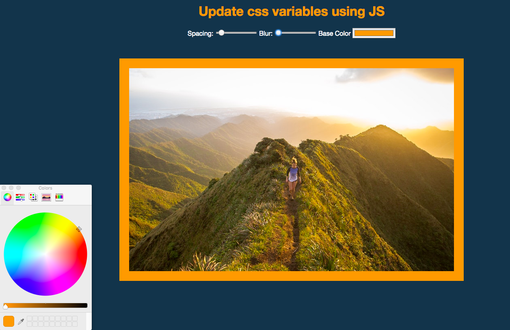

# CSS-Variables using JS

A page that shows how CSS variables can be edited using JS

Self-notes:
- <input type="color"> picks a color
- CSS variables: 
:root{
	—base : ‘pink’;
	—spacing: 15px;
}

body{
	background : var(—base);
}
- document.documentElement returns root of the document
- this.dataset contains data- html
